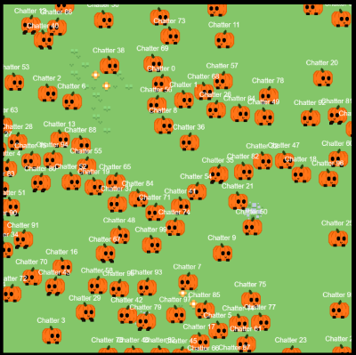

# Pumpkingotchi

is a project inspired by games such as Tamagotchi or Tiny Chao Garden.



Its goal is to create a virtual pets / avatars for twitch viewers in form of a little pumpkin.
Pumpkin will send emotes (Twitch, 7TV, BTTV) matching the viewer's activity.

It is accessible through the browser or the OBS Studio Browser Source.

# Usage

Access the project on [https://glumpkinstudios.github.io/pumpkingotchi/](https://glumpkinstudios.github.io/pumpkingotchi/) or add it as a browser source in OBS Studio.

# Development

## Requirements

To run the project locally, you need to have [Node.js](https://nodejs.org/en/download/) installed.

Additionally it is recommended to use [pnpm](https://pnpm.io/installation/) for package management (if you want to skip this replace `pnpm` with `npm` in the installation step).

## Installation

Clone the repository and install the dependencies:

```bash
git clone https://github.com/glumpkinstudios/pumpkingotchi.git
cd pumpkingotchi
pnpm install

pnpm start
```

And view the project in your browser at [http://localhost:1234](http://localhost:1234).

# Attribution

This project is heavily inspired by [GlowyPumpkin's](https://www.twitch.tv/glowypumpkin/) character "Pipkin" and was created as a fan work with the utmost respect for the original creation. All rights to the character "Pipkin" and any associated works belong to GlowyPumpkin. This fan project is intended solely for entertainment and is not for commercial use.

Special thanks to GlowyPumpkin for bringing so much joy through her streams and inspiring this project.

This project uses some art from [Kenny.nl](https://kenny.nl/) (described in [ASSETS.md](./src/assets/ASSETS.md)).

## Skins

Some skins are made by the members of community.

[Orange suit](./src/assets/skins/running_orangesuit.aseprite) by Orangesuit1.
